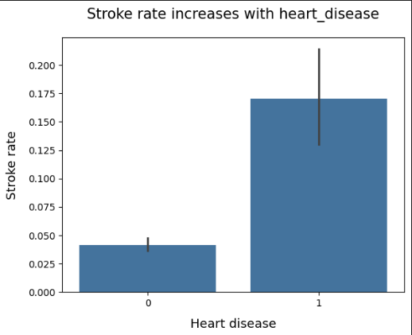
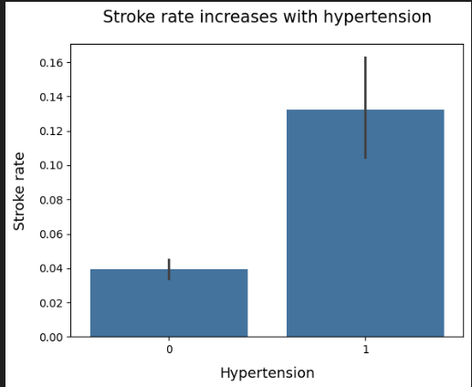
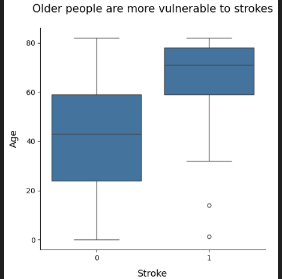

# Stroke Risk Visualization Analysis

## Project Overview
This project analyzes a healthcare dataset of **5,110 patients** to identify risk factors associated with stroke.

The goal was to move beyond simple correlation coefficients and use data visualization to see how specific biomarkers (like heart disease and age) actually impact risk levels in a patient population.

## Key Visualizations & Findings

### 1. Heart Disease vs. Stroke Risk
I compared the stroke probability between patients with and without heart disease. The data shows a clear distinction: patients with a history of heart disease have a significantly higher occurrence of stroke.

### 2. Hypertension Impact
High blood pressure proved to be another strong indicator. The visualization highlights that hypertension is a consistent comorbidity in stroke cases across the dataset.

### 3. Age Distribution Analysis
I plotted the age distribution to identify the critical "risk threshold." The chart shows that while risk exists at younger ages, there is a sharp acceleration in stroke events starting at age 55.

## Tools Used
* **Python**: Core analysis logic.
* **Pandas**: Data cleaning and aggregation.
* **Seaborn & Matplotlib**: Creating the statistical visualizations.

## How to Run
1.  Install dependencies: `pip install -r requirements.txt`
2.  Open `analysis_dashboard.ipynb` to view the code and charts.
